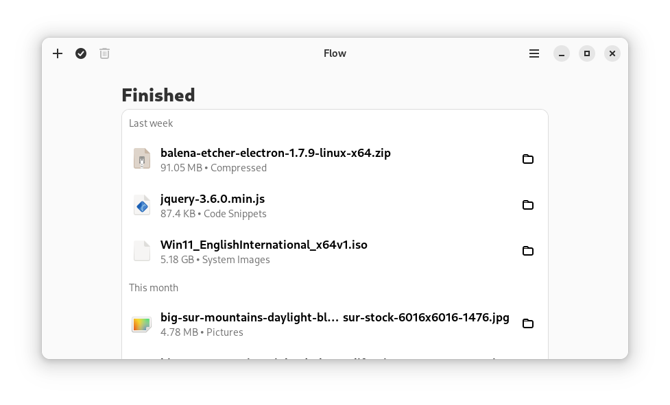

# Flow - The download manager for GNOME



A utility application to automatically organize and keep track of your downloads designed for GNOME. This project is still in development.

This app aims to be an alternative for Internet Download Manager on Linux.

This download manager features basic download with cURL, auto-sorting based on file extension and resuming with new link for broken downloads. More features are coming.

## Browser extension

For now, it is only available for Firefox.

You can find the extension for Firefox [here](https://addons.mozilla.org/en-US/firefox/addon/flow-intercepter/).

## Build from source

**Linux dependencies** `python3`, `meson`, `gtk4`, `libadwaita-1` and `libcurl`.
**Python dependencies** `validators` and `pycurl`.

To build from source & install, clone this repository and build the project with Meson:

```shell
git clone https://github.com/essmehdi/flow.git
cd flow
meson build --prefix=/usr/local
sudo ninja -C build install
```